# Klangverarbeitng im Frequenzbereich

## Tutorials

- MSP Analysis Tutorial 3: Using the FFT
- MSP Analysis Tutorial 4: Signal Processing with pfft~

## Joseph Fourier

## Fourier Theorem

MSP Analysis Tutorial 3: Using the FFT

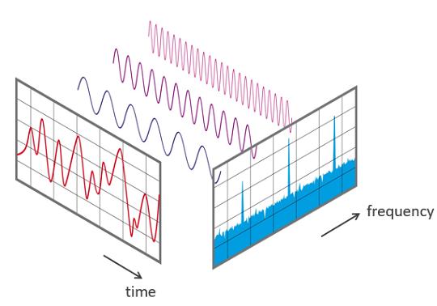

## Zeitbereich vs Frequenzbereich

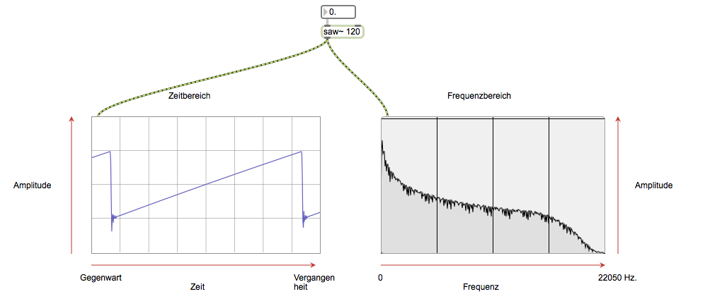

spectroscope~ ist eine Anzeige. Man kann damit nicht das Spektrum ändern.

## FFT Objekte
### fft~ und ifft~

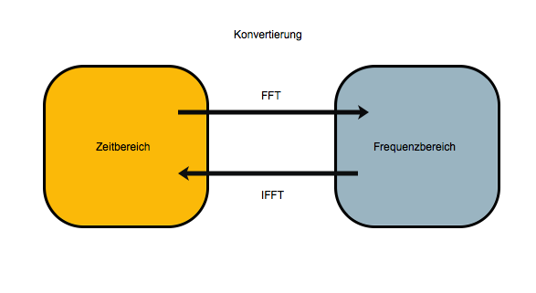
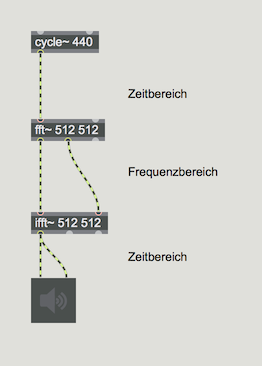

ifft ... inverse FFT.

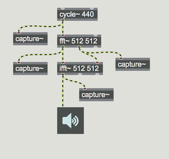

#### Arg1: Window size

Window size = Anzahl von Samples (Abtaste) für eine FFT-Analyze

- FFT Windows size muss 2 hoch n sein.

#### Arg2: Spectral Frame size
Fast immer
Window Size = Spectral Frame Size

#### Arg3: Hop size

FFT Frame Offset

Das ist nötig wenn die OLA-Technik verwendet wird

## Was fft~ ganau macht

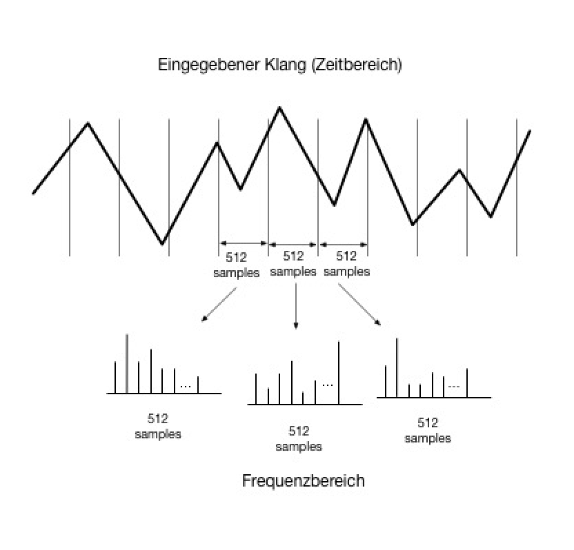

### Einzelheit

### Warum hat fft~ zwei Ausgänge?

### Wie kann man von zwei Singals die Daten des Spektraums konsturieren?
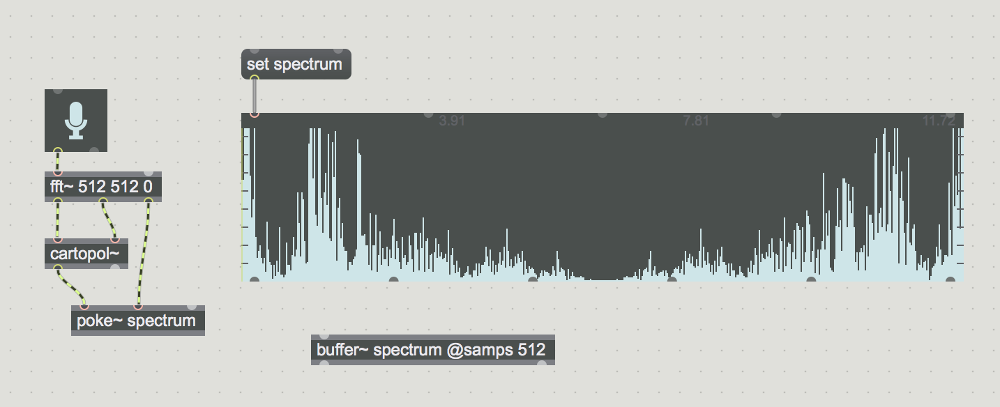

### Das Problem : Phase aligned vs Phase unaligned Signal

#### 8613.28125 Hz = 86.1328125 * 100
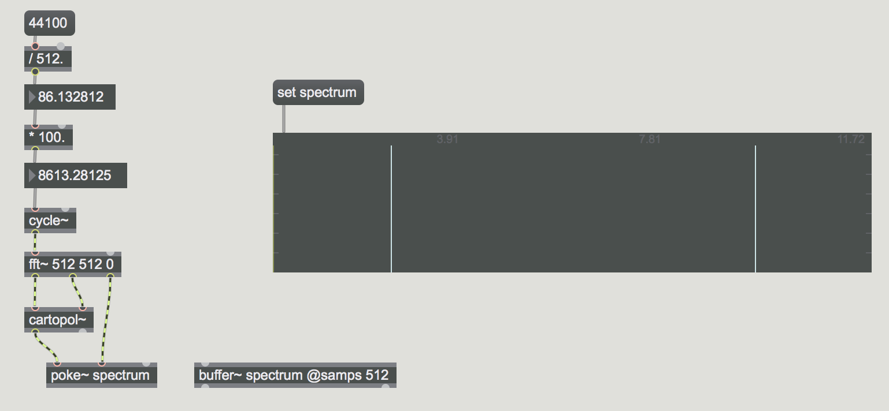
(Phase aligned - eine Linie)

#### 8500 Hz
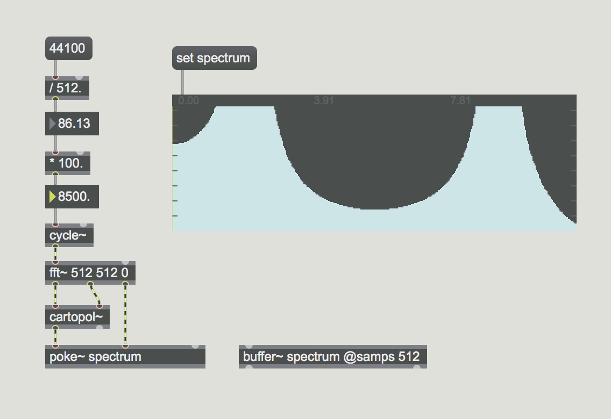
(Phase unaligend - Fehler)

### Die Ursache des Problems

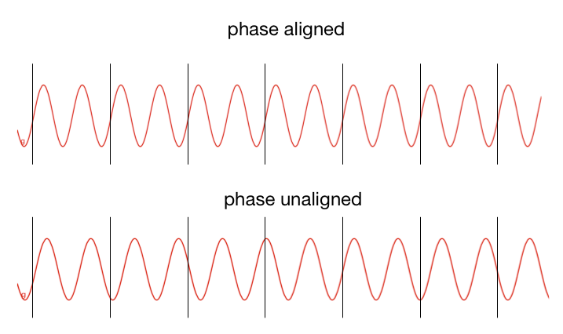

### Die Lösung fürs Problem

Granularsynthese-Technik

- Fensturfunktion
- Overlap and Add

### Fensterfunktion

### Overlap and Add

#### Ohne OLA

#### Mit OLA
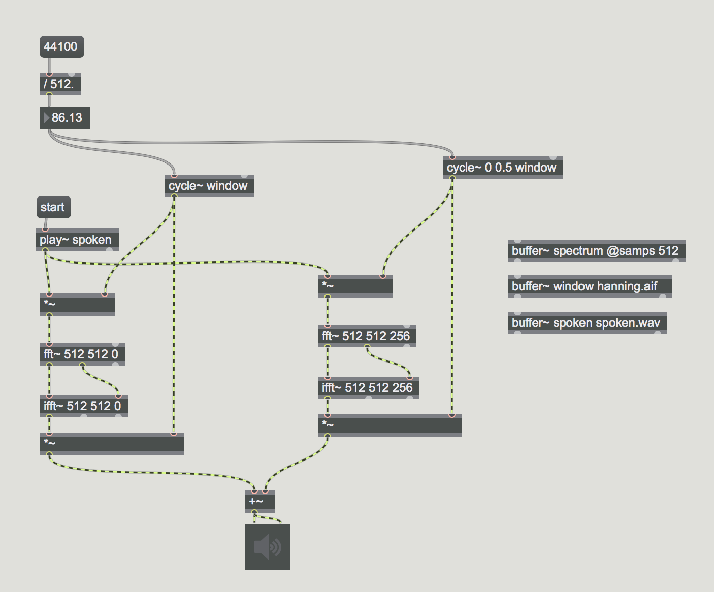

